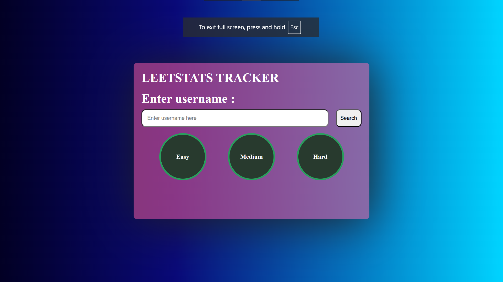

<h1 align="center">📊 LeetStats Tracker</h1>
<h4 align="center">https://piyuscoder.github.io/-LeetStats-Tracker/</h4>

  A simple tool that allows users to check their <b>LeetCode stats</b> (Easy, Medium, Hard) just by entering their username. 
  Built using HTML, CSS, JavaScript, and LeetCode's GraphQL API.

  

---

## 🚀 Features

- 🔍 Enter a LeetCode username to fetch problem-solving stats
- 📈 View problems solved by difficulty: Easy, Medium, Hard
- 🎨 Responsive and attractive UI using CSS
- 🧠 Uses GraphQL API to retrieve data in real-time

---

## 🛠️ Tech Stack

---

## 📸 Screenshot

  

---

## 📦 How to Use

1. 🔗 Clone or download the repository
2. 💻 Open `index.html` in your browser
3. 🔎 Enter any LeetCode username
4. 📊 View their solved problems by difficulty

---

## 📁 Project Structure

📁 leetstats-tracker
├── index.html
├── style.css
├── script.js
└── images
      └── LEet2.png
      └── leetstats tracker image.png

---

## 🧑‍💻 Author

Made with ❤️ by [piyush](https://github.com/piyuscoder)
